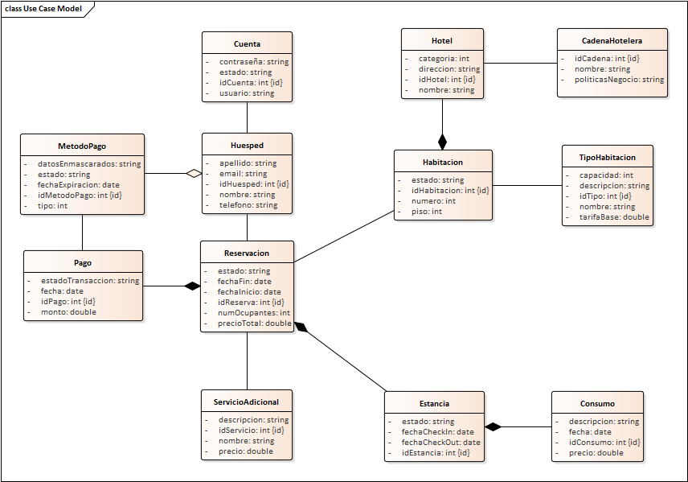

== Vista de Desarrollo

La vista de desarrollo describe la estructura interna del sistema desde el punto de vista de los desarrolladores. 
Su propósito es mostrar cómo se organiza el código fuente, las clases principales y las relaciones entre ellas, 
sirviendo como guía para mantenimiento y evolución del software.

=== Diagrama de Clases

El siguiente diagrama de clases representa los elementos principales del sistema, 
incluyendo clases, atributos, métodos y sus relaciones (asociaciones, agregaciones, composiciones y herencias).

=== Consideraciones de Diseño

* Las clases están organizadas siguiendo el principio de **alta cohesión** y **bajo acoplamiento**.
* Se utiliza **herencia** únicamente donde es estrictamente necesario, priorizando **composición**.
* Se aplican principios SOLID para mantener la mantenibilidad y extensibilidad del sistema.
* Los paquetes agrupan clases relacionadas por funcionalidad para facilitar la navegación del código.